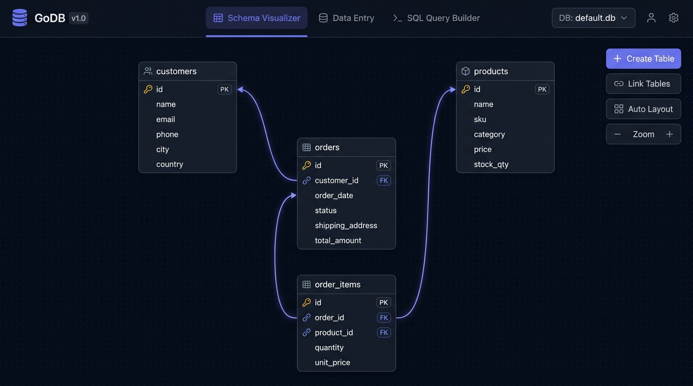

# GoDB - Visual Database & Query Studio

[](https://golang.org)
[](LICENSE)
[](https://github.com/gwarecoder/godb)

**GoDB** is a full-featured, self-contained relational database management application built by [@gwarecoder](https://github.com/gwarecoder) with a high-performance Go backend and an interactive web frontend. It allows users to create databases, visually design and link tables with foreign keys, manage records using intuitive dynamic data entry screens, and construct SQL queries using a visual query builder and raw SQL console.



---

## Key Features

1. **Multi-Database Management**:
   - Create, list, switch, and delete SQLite databases dynamically.
   - Enforces relational foreign key integrity across all connections (`PRAGMA foreign_keys = ON;`).
   - Built-in one-click **Sample E-Commerce Database** (`customers`, `products`, `orders`, `order_items`) for immediate exploration.

2. **Interactive Schema Visualizer**:
   - **ER Diagram Canvas**: Draggable table cards with auto-layout and pan/zoom controls.
   - **Dynamic SVG Connectors**: Smooth cubic bezier curves connecting foreign key columns to their referenced primary key columns with directional arrowheads.
   - **Visual Table Creator**: Modal form to define tables with custom column types (`INTEGER`, `TEXT`, `REAL`, `BOOLEAN`, `DATETIME`, `BLOB`), constraints (`PRIMARY KEY`, `AUTOINCREMENT`, `NOT NULL`, `UNIQUE`, `DEFAULT`), and inline foreign key definitions.
   - **Visual Table Linker**: Add foreign key constraints between existing tables with safe automated table recreation migrations.

3. **User-Friendly Data Entry Screens**:
   - **Smart Foreign Key Dropdowns**: When adding or editing records with foreign keys, the UI automatically inspects referenced tables and displays readable dropdown selectors (e.g. `#1 - Alice Johnson (alice@example.com)`) so you never have to guess or look up raw numeric IDs.
   - **Auto-Generated Inputs**: Appropriate input types (datetime pickers, number steppers, textareas, checkboxes) based on database column schemas.
   - **Spreadsheet-Style Grid**: Instant search filtering, column sorting, pagination controls, and CSV export.
   - **Full CRUD**: Add, edit, and delete records with cascade deletion support.

4. **Visual SQL Query Builder & Console**:
   - **Visual Builder**: Choose base tables, select columns, add filter conditions (`=, !=, >, <, LIKE, IN, IS NULL`), configure `ORDER BY` and `LIMIT`.
   - **1-Click Smart JOINs**: Automatically suggests JOIN clauses based on known foreign key relationships in the schema.
   - **Real-Time SQL Preview**: Live generation of SQL syntax as you customize the builder.
   - **Raw SQL Console**: Monospace code editor with quick SQL templates and execution timing in milliseconds.
   - **Export Results**: Download query results in CSV or JSON format.

---

## Architecture & Technology Stack

- **Backend**: Go (Go 1.22+ standard library `net/http` router, RESTful JSON API).
- **Database Engine**: `modernc.org/sqlite` (100% pure Go SQLite driver, zero CGO/gcc compiler dependencies).
- **Frontend**: Modern vanilla HTML5, CSS3 variables, and ES6 JavaScript (zero runtime external CDN dependencies, fully offline capable).

---

## Prerequisites

- **Go**: Version 1.22 or higher installed ([Download Go](https://go.dev/dl/)).
- **Git**: Installed on your system.
- **Compiler Requirements**: **None!** GoDB uses a pure-Go SQLite driver, meaning no C compiler (`gcc`, `clang`, or CGO) is required.

---

## Installation & Setup

### 1. Clone the Repository

```bash
git clone https://github.com/gwarecoder/godb.git
cd godb
```

### 2. Download Dependencies

Fetch the pure-Go SQLite driver and required modules:

```bash
go mod download
```

*(If you are using the repository's local toolchain, you can run `./bin/go mod download` instead).*

---

## Building and Running the Application

### Method 1: Build a Standalone Binary (Recommended)

Compile a standalone, self-contained binary:

```bash
# Build binary
go build -o godb_app main.go

# Run the application
./godb_app
```

> **Note**: If Go is not in your global system `PATH`, you can use the bundled local binary:
> ```bash
> ./bin/go build -o godb_app main.go
> ./godb_app
> ```

On Windows (Command Prompt or PowerShell):
```cmd
go build -o godb_app.exe main.go
godb_app.exe
```

---

### Method 2: Run Directly with Go (Development Mode)

Run the server directly without manually compiling an executable:

```bash
go run main.go
```
*(or `./bin/go run main.go`)*

---

### Method 3: Run as a Background Process

To keep GoDB running in the background on a server or terminal:

```bash
nohup ./godb_app -port=8080 > godb.log 2>&1 &
```

To stop a background instance:
```bash
pkill godb_app
```

---

## Configuration Options

GoDB supports custom command-line flags:

| Flag | Default | Description | Example |
|---|---|---|---|
| `-port` | `8080` | Port number to bind the HTTP web server | `./godb_app -port=3000` |
| `-data` | `./data` | File directory to store SQLite `.db` databases | `./godb_app -data=/var/lib/godb` |

#### Example: Running on a Custom Port and Data Directory
```bash
./godb_app -port=9000 -data=./my_databases
```

---

## Accessing the Web Interface

Once the server is running, open your web browser and navigate to:

👉 **[http://localhost:8080](http://localhost:8080)**

*(Replace `8080` with your custom port if specified).*

### First Steps:
1. **Load Sample Data**: Click **"Load Sample DB"** in the top navigation bar to populate your database with pre-built interconnected tables (`customers`, `products`, `orders`, `order_items`).
2. **Explore Schema Visualizer**: Drag table cards around the canvas to inspect foreign key links (connected with dynamic SVG arrows).
3. **Create & Link Tables**: Click **"+ Create Table"** to design new tables, or **"Link Tables"** to establish foreign key constraints.
4. **Enter Data**: Switch to the **Data Entry** tab to add, edit, or delete records. Foreign key fields automatically display readable dropdown selectors (e.g. `#1 - Alice Johnson (alice@example.com)`).
5. **Run Queries**: Switch to the **SQL Query Builder** tab to build visual queries with 1-click JOINs, or write custom queries in the raw SQL editor.

---

## Running Automated Tests

GoDB includes comprehensive unit and integration tests covering database switching, schema creation, table linking migrations, cascading foreign key deletes, CRUD operations, and query builder generation:

```bash
# Run all tests
go test -v ./...

# Run tests without cache
go test -count=1 -v ./...
```

---

## API Overview

| Method | Endpoint | Description |
|---|---|---|
| `GET` | `/api/databases` | List all databases and get active database name |
| `POST` | `/api/databases` | Create and switch to a new SQLite database |
| `POST` | `/api/databases/switch` | Switch active database |
| `DELETE` | `/api/databases/{name}` | Delete a database file |
| `POST` | `/api/databases/sample` | Seed active database with sample e-commerce tables |
| `GET` | `/api/schema` | Get schema graph (tables, columns, foreign keys, row counts) |
| `POST` | `/api/tables` | Create a new table with columns and foreign keys |
| `DELETE` | `/api/tables/{name}` | Drop a table |
| `POST` | `/api/tables/link` | Add foreign key relationship between tables |
| `GET` | `/api/data/{table}` | Get paginated table rows with search & sort |
| `POST` | `/api/data/{table}/row` | Insert new row into table |
| `PUT` | `/api/data/{table}/row` | Update existing row by primary key |
| `DELETE` | `/api/data/{table}/row` | Delete row by primary key |
| `GET` | `/api/data/{table}/fk-options` | Fetch readable foreign key options for dropdowns |
| `POST` | `/api/query/preview` | Preview SQL generated from query builder |
| `POST` | `/api/query/build` | Build and execute visual query builder AST |
| `POST` | `/api/query/execute` | Execute arbitrary SQL query |

---

## License

This project is licensed under the [MIT License](LICENSE) - see the LICENSE file for details.
